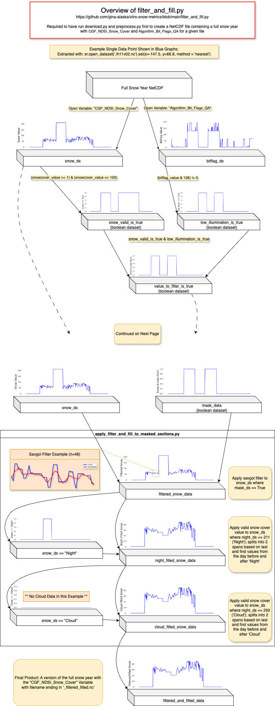

# Snow Metrics User Guide

VIIRS Snow Metrics v001 were generated from the [VIIRS/NPP CGF Snow Cover Daily L3 Global 375m SIN Grid, Version 2](https://nsidc.org/data/vnp10a1f/versions/2) data products downloaded from NASA Earthdata. These products are produced as daily HDF5 files on a sinusodal grid. Processing code and descriptions of individual methods used are available in the [GitHub Repository](https://github.com/gina-alaska/viirs-snow-metrics). 

### Composite Snow Metric GeoTIFFs
#### Filename Convention
`{SNOW_YEAR}_VIIRS_snow_metrics_v001.tif`
#### Spatial Resolution
375 m
#### Spatial Bounds
Datasets are in Alaska Albers projection (EPSG:3338) and encompass the entirety of Alaska.

Maximum Lat/Lon Bounds:  
North: 73.18
South: 50.19
West: 160.86
East: -110.56

#### Time Range

Data is available from August 1st, 2013 - July 31st, 2024.

Individual files represent a single Snow Year (August 1st of the year prior to July 31st of the Snow Year).

For metrics with days as units, a value of 1 indicates August 1st. Leap years are included - as such, the highest possible unit will be 365 or 366 depending on the year.

#### Metrics

VIIRS Snow Metrics v001 contains 10 bands:

1. First Snow Day of the full snow season (FSS). Also called FSS start day.
	_Units: Day: `08/01/(SNOW_YEAR-1)` - `07/31/SNOW_YEAR`_
	
2. Last Snow Day of the FSS. Also called FSS end day.
	_Units: Day: `08/01/(SNOW_YEAR-1)` - `07/31/SNOW_YEAR`_
	
3. FSS Range: the length (duration) of the full snow season.
	_Units: Number of Days_
	
4. Continuous Snow Season (CSS) Start Day: First day of longest CSS segment.
	 _Units: Day: `08/01/(SNOW_YEAR-1)` - `07/31/SNOW_YEAR`_
	 
5. CSS End Day: last day of longest CSS segment.
	 _Units: Day: `08/01/(SNOW_YEAR-1)` - `07/31/SNOW_YEAR`_
	 
6. CSS Range: the length (duration) of the longest CSS segment.
	_Units: Number of Days_
	
7. Number of Snow Days: count of all snow-covered days in a snow year
	_Units: Number of Days_
	
8. Number of No Snow Days: count of all not snow-covered days in a snow year
	_Units: Number of Days_
 
9. Number of discrete CSS segments.
	_Units: Number of Segments_

10. Total CSS Days: summed duration of all CSS segments
	_Units: Number of Days_

#### Algorithm Description

Daily products for tiles over Alaska are downloaded as HDF5 files for a given Snow Year (August 1st of the year prior to July 31st of the Snow Year). For each tile, the HDF5 files are sorted by date and stacked into a year-long netcdf dataset. Due to limited illumination during winter, higher latitudes have significant portions of time with data quality limitations. Metadata in the products indicating low illumination and night are used to filter out sections of poor or no data and fill them with a smoothing algorithm (Figure 1).

A combined mask is created to identify locations categorized as ocean, inland water, and where no data is available. From the smoothed datasets, in locations not masked out, a series of metrics are calculated. Valid snow data in the CDF Snow Cover data is represented by values from 0 - 100; a minimum threshold of 20 was used for v001.

Snow metrics are produced as GeoTIFF files for individual tiles. All tiles for a given metric are then reprojected the Alaska Albers (EPSG:3338) and mosaicked into a single file. Files for each metric are stacked into a final ten-band GeoTIFF.